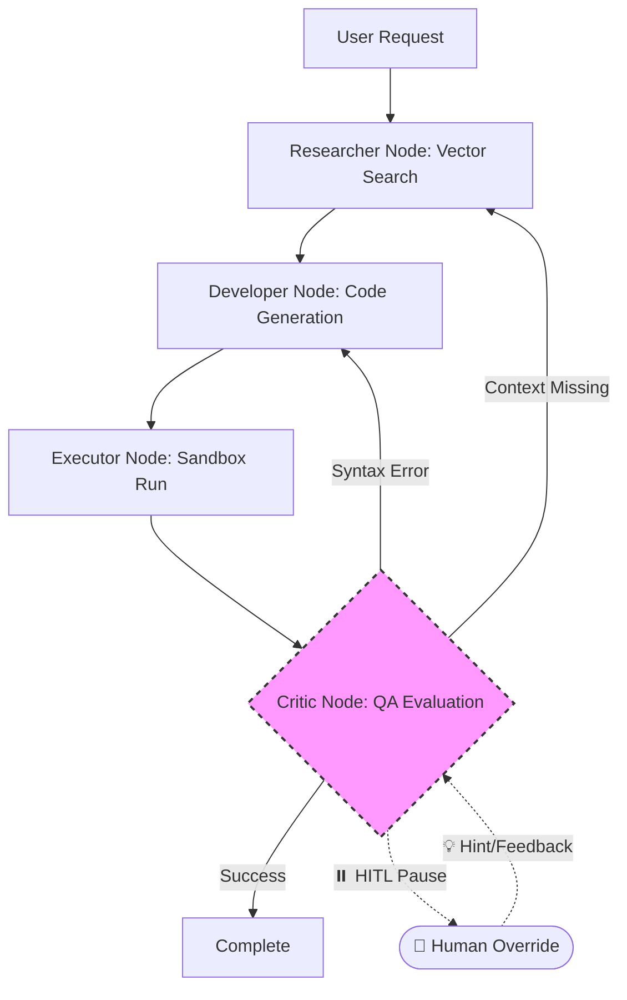

<div align="center">

  <h1 align="center">🚀 Agentic API Engine</h1>
  
  <p align="center">
    <strong>Enterprise-grade, Fully Autonomous Multi-Agent Integration System</strong>
    <br />
    <br />
    <a href="#-key-features">✨ Features</a>
    ·
    <a href="#-architecture">🏗 Architecture</a>
    ·
    <a href="#-quick-start">🚀 Quick Start</a>
    ·
    <a href="#-human-in-the-loop">👤 Human-in-the-Loop</a>
    ·
    <a href="#-usage-guide">📖 Usage</a>
  </p>
  
  <p align="center">
    
    
    
    
    
  </p>
</div>

---

<div align="center">
  
</div>

---

## ⚡ Overview

**Agentic API Engine** empowers developers to rapidly prototype and integrate complex third-party APIs completely autonomously. By simply providing a URL to an API documentation page, the multi-agent system (powered by Google Gemini and LangGraph) will:

1. **Read** and comprehend the documentation.
2. **Write** the necessary Python integration code.
3. **Sandbox** the execution safely, automatically installing missing dependencies.
4. **Self-Heal** by analyzing execution errors and dynamically modifying its approach until successful.

All of this is presented through a beautiful, glassmorphic React frontend with real-time bi-directional WebSockets, making it feel alive and incredibly satisfying to watch.

---

## ✨ Key Features

<details>
<summary><b>🤖 Autonomous Multi-Agent System</b></summary>
<br/>

- **Researcher (RAG Node)**: Scrapes API docs dynamically, chunks data, and queries ChromaDB.
- **Developer (Coding Node)**: Generates structured JSON containing step-by-step reasoning and raw Python integration scripts.
- **Executor (Sandbox Node)**: Spawns isolated Python venvs, auto-installs `pip` requirements, and captures STDOUT/STDERR safely.
- **Critic (QA Node)**: A self-healing routing agent. Routes syntax bugs back to the Developer, and semantic API errors back to the Researcher.

</details>

<details>
<summary><b>💻 Premium React Dashboard</b></summary>
<br/>

- **Bi-directional WebSockets**: Watch the agents think and execute in real-time natively in the browser with ultra-low latency.
- **Glassmorphic Aesthetics**: Built with CSS variables, light/dark modes, responsive mobile layouts, and smooth micro-animations.
- **Job History Tracking**: Review and retry historical runs seamlessly.
</details>

<details>
<summary><b>👤 Human-in-the-Loop (HITL) Capabilities</b></summary>
<br/>

- **Execution Pausing**: Intervene before critical steps to inject hints into the agent stream.
- **Dynamic Override**: If the AI hits an undocumented API endpoint, the user can manually pass the `Bearer` token or schema rules directly to the LangGraph node!
</details>

<details>
<summary><b>🔒 Secure & Persistent Backend</b></summary>
<br/>

- **FastAPI Core**: Async, high-performance API handling routing and WebSockets.
- **PostgreSQL / SQLite**: Persistent storage for User accounts, JWT session state, and execution history.
- **Secure Sandboxing**: LLM-generated code executes in dynamically spawned virtual environments to protect system dependencies.
</details>

---

## 🏗 Architecture Workflow



---

## 🚀 Quick Start

### 1. Prerequisites
- **Node.js** v18+ & **npm**
- **Python** 3.9+
- **Google Gemini API Key**
- *(Optional)* PostgreSQL for production (Defaults to SQLite for local ease)

### 2. Backend Setup

```bash
# Clone the repository
git clone https://github.com/ChandikaWi/agentic-api-engine.git
cd agentic-api-engine

# Create and activate virtual environment
python -m venv venv
source venv/bin/activate  # On Windows use: .\venv\Scripts\activate

# Install dependencies
pip install fastapi uvicorn websockets sqlalchemy psycopg2-binary passlib bcrypt pyjwt langgraph langchain langchain-google-genai langchain-chroma pydantic beautifulsoup4 requests python-dotenv

# Configure environment variables
echo "GOOGLE_API_KEY=your_gemini_api_key_here" > .env
echo "SECRET_KEY=generate_a_secure_random_key_here" >> .env

# Start the Backend Server
uvicorn api:app --reload --port 8000
```

### 3. Frontend Setup

```bash
# Open a new terminal window
cd frontend

# Install dependencies
npm install

# Configure environment variables
echo "VITE_API_URL=http://localhost:8000" > .env

# Start the Frontend App
npm run dev
```

---

## 📖 Usage Guide

1. **Ingest Documentation**: Enter the target URL of the API documentation you wish to integrate with (e.g., *Stripe API Docs*) in the **Ingest Source** input.
2. **Define Integration Task**: Tell the agent exactly what you want it to build using natural language (e.g., *"Write a script to fetch a random joke and print the setup and punchline"*).
3. **Launch & Watch**: Click **Launch Agent**. The real-time WebSocket stream will paint the console as the agents research, code, test, and self-heal.
4. **Access History**: Click the **View Job History** button to review past integrations, complete with their successful scripts and dependency manifests.

---

## 🛡️ Security Disclaimer

> **Warning**
> This application utilizes a custom Python Sandboxing module (`sandbox.py`) to execute dynamically generated code. While dependencies are securely managed inside isolated virtual environments, the sandbox currently shares the host OS kernel's network and disk permissions. **It is highly recommended to run the backend inside a strict Docker container or VM for full production isolation.**

<div align="center">
  <br/>
  <sub>Built by Chandika Wickramasena for advanced autonomous engineering.</sub>
</div>
